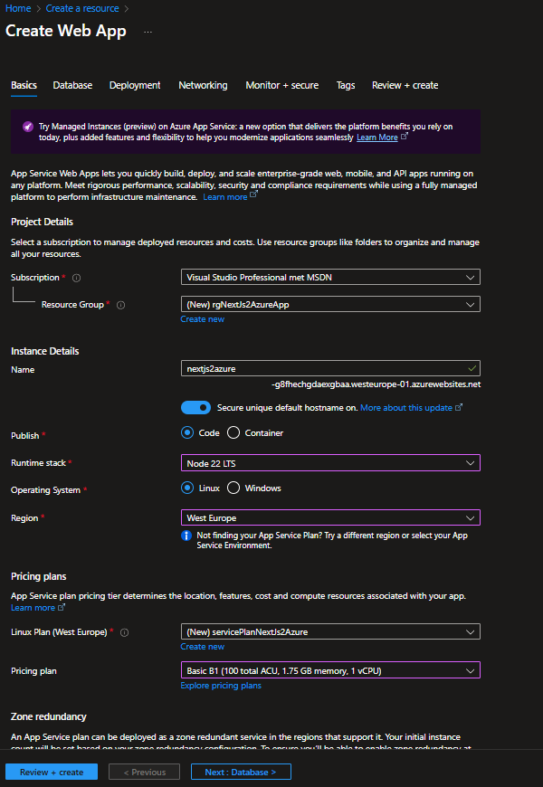
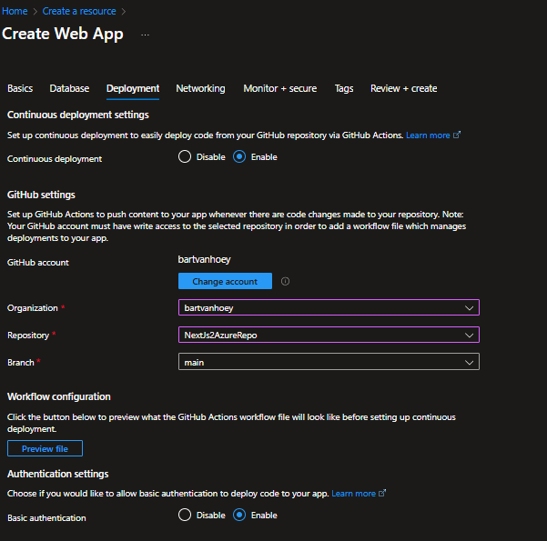
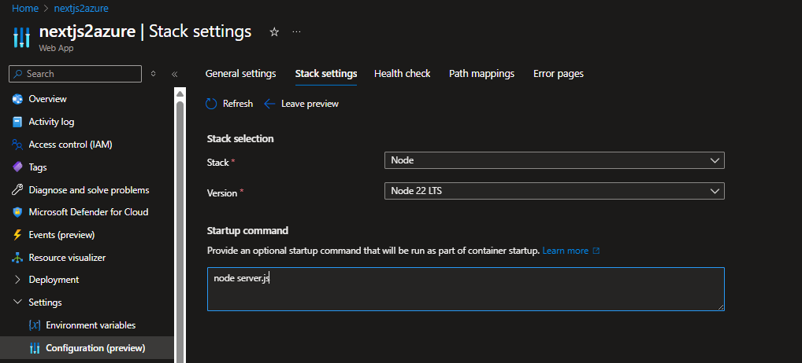

# Deploy NextJs to Azure: Step-by-Step Guide

This guide will walk you through the process of deploying a Next.js application to Microsoft Azure. Follow these steps to get your application up and running in the cloud.

## Step 1: Create a GitHub Repository

First, create a new repository on GitHub to host your Next.js application code.

## Step 2: Create a Next.js Application

Create a new Next.js application using the following commands:

```bash
// create a new Next.js app
npx create-next-app@latest your-name-app --yes
// navigate into the app directory
cd my-nextjs-app
// start the development server
npm run dev
```

## Step 3: Update next.config.js

In your Next.js project, open the `next.config.js` file and update the following configuration:

```javascript
module.exports = {
  reactStrictMode: true,
  distDir: "build",
  output: "standalone",
};
```

## Step 4: Add an .env.local file to root of Next.Js project

Create a file `.env.local` in the root of your Next.Js project and add the following environment variable:

```bash
NEXT_PUBLIC_BASE_URL=http://localhost:3000
```

## Step 5: Push Your Code to GitHub

Initialize a git repository, commit your code, and push it to your GitHub repository:

```bash
git add .
git commit -m "Initial commit"
git push
```

## Step 6: Create an Web App on Azure

Login into the Azure Portal. Click on Create a resource and search for Web App.
Set up a new Web App on Azure by following these steps:





Review and create the web app.

## Step 7: Set Stack Settings



## Step 8: Copy the Publish Profile and the Default domain url

Once the Web App is created, navigate to the Web App's Overview page. Click on "Get publish profile" to download the publish profile XML file. Copy the XML content from this file.

Copy the Default domain url from the Overview page as well, you will need it later.

## Step 9: Add Action Secrets in GitHub

In your GitHub repository, navigate to the Settings > Secrets and variables > Actions section. Add the following secrets:

- `AZURE_WEBAPP_PUBLISH_PROFILE`: Paste the content of the publish profile XML file you copied earlier.
- `NEXT_PUBLIC_BASE_URL`: Paste the Default domain url you copied earlier.

## Step 10: Fetch GitHub Action Workflow

Open a terminal in your Next.js project directory and run the following command to fetch the GitHub Action workflow for Azure deployment:

```bash
git pull
```

This will add a new workflow file in the `.github/workflows` directory of your project.

## Step 11: Update the Workflow File

Open the workflow file located at `.github/workflows/azure-webapps.yml` and update the file with the following content:

```yaml
# Docs for the Azure Web Apps Deploy action: https://github.com/Azure/webapps-deploy
# More GitHub Actions for Azure: https://github.com/Azure/actions

name: Build and deploy Node.js app to Azure Web App

on:
  push:
    branches:
      - main
  workflow_dispatch:
env:
  APPLICATION_PUBLISH_PROFILE: ${{ secrets.AZURE_WEBAPP_PUBLISH_PROFILE }}
  WEBAPP_NAME: "nextjs2azure"
  NEXT_PUBLIC_BASE_URL: ${{ secrets.NEXT_PUBLIC_BASE_URL }}

jobs:
  build:
    runs-on: ubuntu-latest
    permissions:
      contents: read #This is required for actions/checkout

    steps:
      - uses: actions/checkout@v4

      - name: Set up Node.js version
        uses: actions/setup-node@v3
        with:
          node-version: "22.x"

      - name: npm install, build, and test
        run: |
          npm install
          npm run build --if-present
          npm run test --if-present

      - name: Upload artifact for deployment job
        uses: actions/upload-artifact@v4
        with:
          name: node-app
          path: .

  deploy:
    runs-on: ubuntu-latest
    needs: build

    steps:
      - name: Download artifact from build job
        uses: actions/download-artifact@v4
        with:
          name: node-app

      - name: "Deploy to Azure Web App"
        id: deploy-to-webapp
        uses: azure/webapps-deploy@v3
        with:
          app-name: ${{ env.WEBAPP_NAME }}
          slot-name: "Production"
          package: ./build/standalone
          publish-profile: ${{ env.APPLICATION_PUBLISH_PROFILE }}
```

## Step 12: Commit and Push Changes

Commit the changes to the workflow file and push them to your GitHub repository:

```bash
git add .
git commit -m "Update Azure Workflow"
git push
```

## Step 13: Monitor GitHub Actions

In your GitHub repository, navigate to the "Actions" tab to monitor the progress of your deployment.
You should see a new workflow run triggered by your recent push. Wait for the workflow to complete successfully.

## Step 14: Access Your Deployed Application

Once the deployment is complete, you can access your Next.js application using the Default domain url you copied earlier.
Open your web browser and navigate to that URL to see your application live on Azure!

navigate to this [url](nextjs2azure-g8fhechgdaexgbaa.westeurope-01.azurewebsites.net) to see your application live on Azure!
